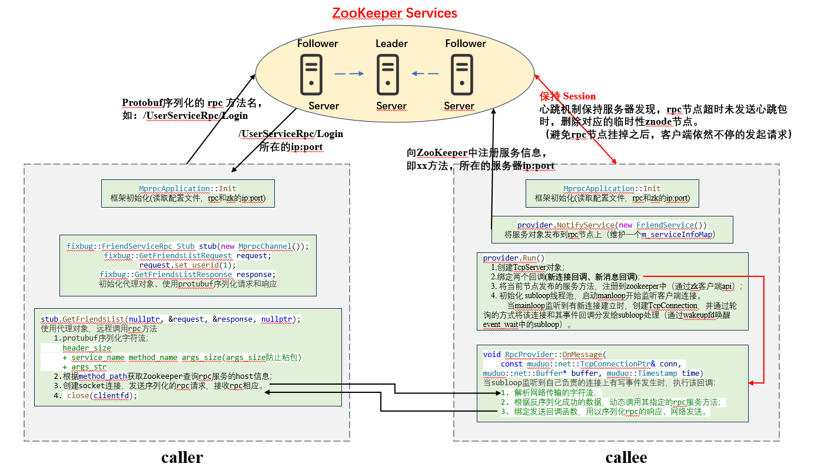
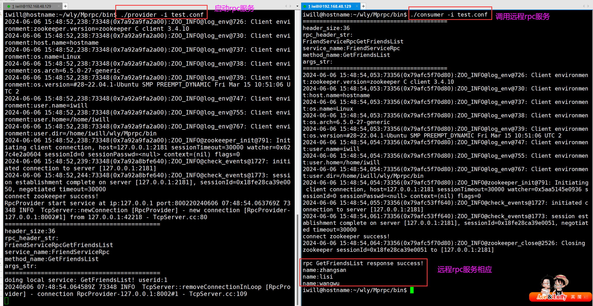

# 0. Mprpc
**项目交互图：** 


- - - - - - - - - - - - - - - - - - - - 

**项目名称：** 基于 Muduo 和 Protobuf 的分布式网络通信框架Mprpc

**项目内容：**
- <b>分布式服务框架构建</b>： 通过 <b>Muduo 网络库和 RPC 机制</b>构建高效灵活的分布式服务框架，为系统提供通信基础；
- <b>高性能数据传输保障</b>： 使用 <b>Protobuf 进行数据序列化和反序列化</b>， 确保数据在传输中的高效性和平台兼容性；
- <b>网络传输优化</b>： 设计并实现<b>自定义私有通信协议</b>有效解决了 <b>TCP 粘包</b>， 保证 RPC 调用时网络传输参数的准确性；
- <b>分布式一致性与服务发现</b>： 利用 <b>ZooKeeper 集群提供一致性协调服务</b>，实现服务配置的<b>集中管理与高可用性发现</b>；
- <b>异步日志处理</b>： 通过集成<b>双缓冲区异步日志库</b>， 减少了<b>系统响应时间和日志落盘线程的唤醒开销</b>；
- <b>遥感图像检测服务</b>： 搭建<b>实时目标检测服务</b>， <b>多线程处理 RTMP 数据流</b>（读流、目标检测算法处理、推流）。

**项目收获：** 熟悉了分布式的概念及原理、 RPC 远程过程调用的原理及实现和 ZooKeeper 分布式一致性协调服务的应用。

- - - - - - - - - - - - - - - - - - - - 

# 1. 环境配置
## 1.1 安装cmake、g++等编译环境

```bash
# 安装cmake、g++等编译环境
sudo apt-get install cmake	
sudo apt-get install g++
sudo apt-get install gcc
```


## 1.2 安装 muduo

```bash
# muduo依赖于Boost，所以需要安装Boost（一个准标准库）
sudo apt-get install libboost-dev libboost-test-dev		

# 编译安装muduo（基于Reactor模式的网络库）
git clone https://github.com/chenshuo/muduo.git
cd muduo
./build.sh -j2									# 编译muduo库和它自带的例子（生成的编译文件位于muduo同级目录）
./build.sh install  							# 将muduo头文件和库文件安装到build/release-install-cpp11/lib
sudo mv ../build/release-install-cpp11/include/muduo/ /usr/include/		# 将inlcude（头文件）拷贝到系统目录
sudo mv ../build/release-install-cpp11/lib/* /usr/local/lib/			# 将lib（库文件）拷贝到系统目录
cd ..
sudo rm build/ muduo/ -r
```


## 1.3 安装 protobuf
```bash
下载连接：https://github.com/protocolbuffers/protobuf
unzip protobuf-master        # 解压压缩包
cd protobuf-master
sudo apt-get install autoconf automake libtool curl make g++ unzip     # 安装所需工具（可以单个安装，方便排错）
./autogen.sh                # 自动生成configure配置文件
./configure                 # 配置环境
make                        # 编译源代码(时间比较长)
sudo make install           # 安装（主要是拷贝头文件和库文件到本地）
sudo ldconfig               # 刷新动态库
```

## 1.4 安装 zookeeper
```bash
sudo apt install openjdk-17-jdk             # zookeeper是java开发，依赖jdk

tar -zxvf zookeeper-3.4.10
cd conf
cp zoo_sample.cfg zoo.cfg
vim zoo.cfg                                 # 修改 dataDir（默认使用的/tmp，重启时数据会清空）

cd ../bin
./zkServer.sh start
ps -ef | grep zookeeper
sudo netstat -tanp                          # 查看是否启动了运行在端口2181的java服务
./zkCli.sh                                  # 启动客户端测试


# zookeeper的 原生API安装（C/C++ 接口）
~/zookeeper-3.4.10/src/c/  $ sudo ./configure
~/zookeeper-3.4.10/src/c/  $ sudo make               # 根据Makefile文件编译
~/zookeeper-3.4.10/src/c/  $ sudo make install       # 将编译完成的文件拷贝至 /usr/local/include、lib、bin
~/zookeeper-3.4.10/src/c/  $ sudo ldconfig           # 刷新动态库
```


# 2. 编译项目
```bash
cd Mprpc
sudo chmode 777 autobuild.sh
./autobuild.sh
```


# 3. 项目测试
```bash
cd bin
./provider -i test.conf
./consumer -i test.conf
```


